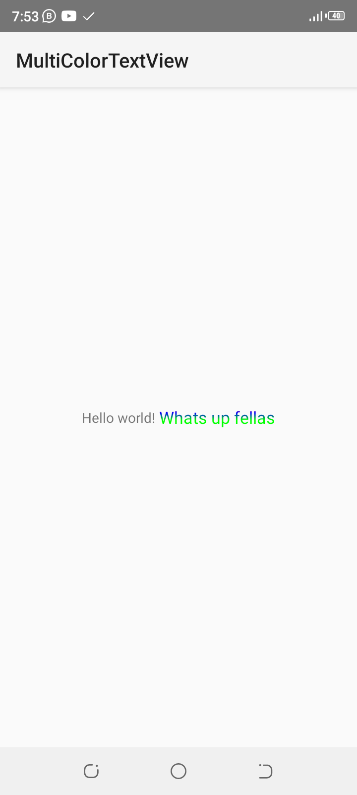

# MultiColorTextView

This Package Allows you to add multiple colours and styles to your text in Android Programing.
It is easy to use and you can create dynamic designs with include gradient text and the ability to colour useful part of your text 
To use kindly download the jar file <a href="https://raw.githubusercontent.com/SanneEmmanuel/MultiColorTextView/main/bin/MultiColorTextView.jar">here</a> and rename the file <i>MultiColorTextView.bin</i> to <b>MultiColorTextView.jar</b>
 <b>OR</b>
clone repository by

```shell
git clone www.github.com/sanneemmanuel/MultiColorTextView
```
 
## Intro
This is a dynamic TextView creaed by <a href="https://www.facebook.com/sansax.bassist.5">Sanne Karibo</a> that enables Programmers add different colours to one textview
It is easy to use and has all the regular functions of a normal TextView only More.

<p align="center">
  
</p>


## Install
To add the dependency to Your Project kindly navigate to the bin folder and copy the <b>MultiColorTextView.jar</b> or download  it <a href="https://raw.githubusercontent.com/SanneEmmanuel/MultiColorTextView/main/bin/MultiColorTextView.jar">here</a> Rename it to .jar not .bin and place in your <a href="https://stackoverflow.com/questions/11136485/how-can-i-create-libs-folder-in-my-project-android&ved=2ahUKEwiIt--D4JL9AhVna_EDHeqyBFcQrAIoAnoECA0QAw&usg=AOvVaw08NB84ARSV5vcKGWQueXXq">libs</a> folder
Then use in Your Android Activity 
```Java
import com.sanne.MultiColorTextView;

MultiColorTextView textview= new MultiColorTextView(this);
textview.setText("SOME TEXT");
textview.colorAll("TEXT",Color.RED);

```

<p> In the Above a MultiColorTextView is created in java and text is Added programmatically, then all the occurances of a particular text is coloured Red</p>


```xml
<LinearLayout xmlns:android="http://schemas.android.com/apk/res/android"
    android:layout_width="match_parent"
    android:layout_height="match_parent"
    android:gravity="center"
	android:orientation="vertical">
<com.sanne.MultiColorTextView
	android:id="@+id/text"
	android:text="@string/hello_world"
	android:layout_width="wrap_content"
	android:layout_height="wrap_content" />
</LinearLayout>
```

<p> In this example a layout file is created for the activity and the MultiColorTextView is given an id of 'text'</p>
<p> You can use the xml layout in mainActivity by calling

```Java
MultiColorTextView text= findViewById(R.id.text);
```

## Usage
<b>The Library has lots of Functions that could be used</b>
It offers a mean of adding bullets point to your TextView by
```java
multiColorTextView.addBulletPoint("Bullet Text");
```
Or if You desire to have more control over space and colour of the bullet point, You can use
<pre>
int spaceFromText= 10;
int colorOfBullet= Color.BLACK;
multiColorTextView.addBulletPoint("Enter Text Here",colorOfBullet,spaceFromText);
</pre>


You Can Also add New Text with unique colours to each
```java
multiColorTextView.addText("A Text",android.graphics.Color.BLUE);
```

<b> You can Colour Important Text with unique colour by</b>
```java
multiTextView.colorAll("IMPORTANT TEXT",android.graphics.Color.RED);
```

<i>Alternatively</i> you can add colour to only the first or last instance or aooearabce of a text by
```java
multiColorTextView.colorFirstOccurance("TEXT",android.graphics.Color.BLACK);
multiColorTextView.colorLastOccurance("TEXT",android.graphics.Color.BLACK);
```

## Restrictions/Limitations
<b>Do not Directly Put a Colour in Res folder like</b>
<pre>text.addText("TEXT", R.color.ANY);</pre>
This would pass the id of the colour rather than the colour, so instead <b> use</b>
<pre>text.addText("TEXT", getColor(R.color.ANY));</pre>
Or preferably use a colour Hex code 
<details>
<summary>
THE PROJECT HAS NO EXTERNAL DEPENDENCY AND IS SUPPORTED IN VARIOUS VERSIONS OF THE ANDROID OS
</summary>
MIT © [Sanne Karibo]"https://www.github.com/sanneemmanuel"
</details>
